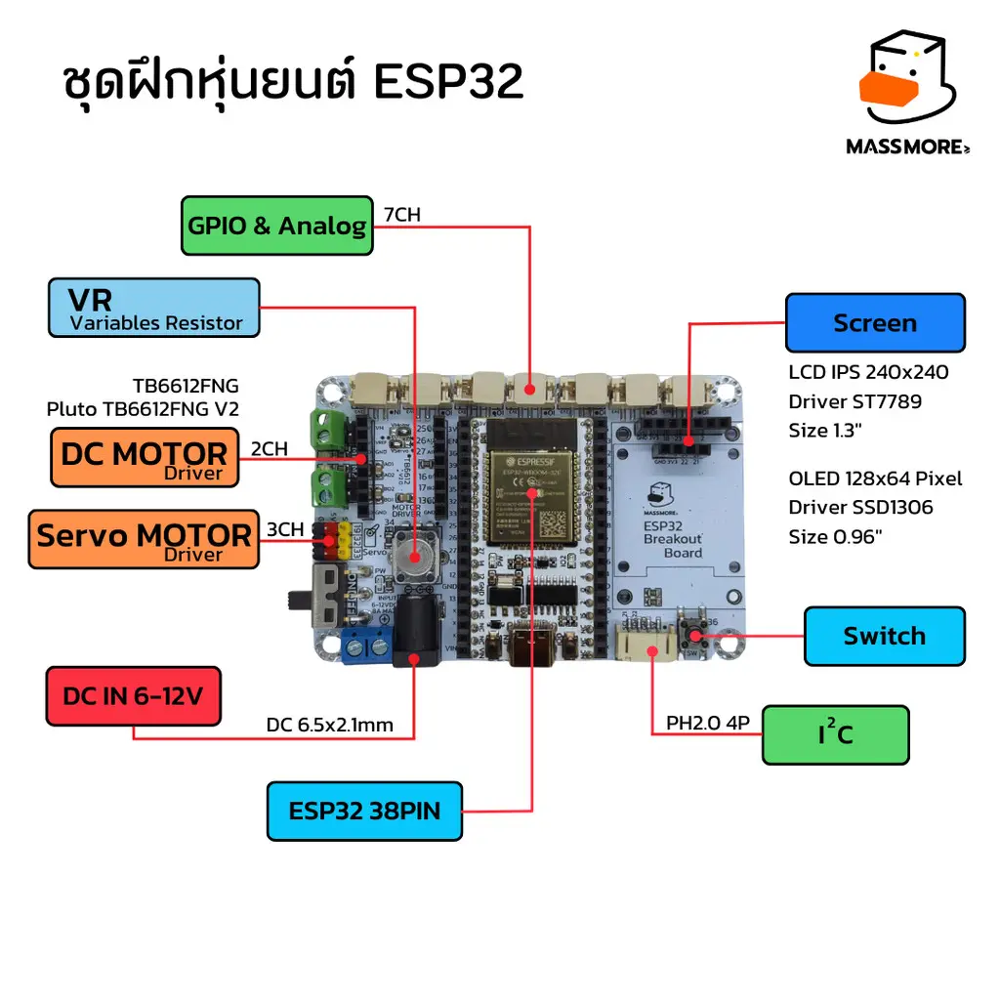

# SKU-1015 — ESP32 38PIN Breakout Board (ชุดฝึกหุ่นยนต์ Robot / Prototype)

<p align="center">
  
</p>

**บอร์ดขยาย ESP32 38PIN สำหรับงานหุ่นยนต์ IoT และการเรียนรู้ Arduino** ออกแบบและจำหน่ายโดย [Massmore](https://www.massmore.shop) — รองรับ DC Motor Driver, Servo 3 ช่อง, จอ TFT/OLED, Analog I/O 7 ช่อง พร้อม DC-DC Step Down 5V/3A ในบอร์ดเดียว

**ESP32 38PIN Breakout Board for robotics, IoT, and Arduino learning** designed by [Massmore](https://www.massmore.shop) — supports DC motor drivers, 3-channel servo output, TFT/OLED displays, 7-channel analog I/O, with an onboard 5V/3A DC-DC step-down converter.

📄 **คู่มือฉบับเต็ม (Full Thai Manual):** [`Document/Manual`](Document/Manual)

---

## 🛒 สินค้าในชุด (Product Set)

| # | สินค้า / Product | SKU | Link |
|---|---|---|---|
| 1 | บอร์ดขยาย ESP32 38PIN Breakout Board | SKU1015 | [massmore.shop](https://www.massmore.shop/products/1cbd7c12-166a-4cbb-bbc6-3d7fdce0775c) |
| 2 | บอร์ดพัฒนา ESP32-WROOM-32E/32UE 38PIN CH340 | SKU1016 | [massmore.shop](https://www.massmore.shop/products/819d35cb-3693-4d0f-8b10-4ff37821161f) |
| 3 | โมดูลขับมอเตอร์ 2CH TB67H450 (แทน TB6612) | SKU1002 | [massmore.shop](https://www.massmore.shop/products/6429a185-604c-4f1e-9dfd-59745e82258b) |
| 4 | จอ TFT LCD SPI IPS 240×240 ST7789 1.3"/1.54" | SKU0014 | [massmore.shop](https://www.massmore.shop/products/0058df49-88b0-4422-b0b2-0ddc18beafa2) |

## ✨ Features

- ✅ รองรับโมดูล ESP32 38PIN (ESP32-WROOM-32E / NodeMCU-32S / DevKitC)
- ✅ DC Motor Driver 2CH — เสียบโมดูล TB6612FNG / TB67H450 ได้โดยตรง
- ✅ Servo Motor 3 ช่อง (GPIO19, 32, 33) ไฟเลี้ยงจาก 5V/3A บนบอร์ด
- ✅ จอแสดงผล: TFT IPS 240×240 ST7789 (SPI) หรือ OLED 128×64 SSD1306 (I2C)
- ✅ GPIO & Analog Input 7 ช่อง (IO1–IO7) + VR 1 ช่อง + Switch 1 ช่อง
- ✅ พอร์ต I2C (PH2.0 4P) — SDA=GPIO21, SCL=GPIO22
- ✅ DC-DC Step Down: Input 6–12V → Output 5V/3A
- ✅ ขนาดบอร์ด 90 × 60 mm

## 📌 Pinout

| Function | Pin | GPIO | Description |
|---|---|---|---|
| **DC Motor** | M1_IN1 / M1_IN2 | GPIO27 / GPIO26 | Motor 1 Direction 1 / 2 |
| | M2_IN1 / M2_IN2 | GPIO16 / GPIO17 | Motor 2 Direction 1 / 2 |
| **Servo** | Servo1 / Servo2 / Servo3 | GPIO19 / GPIO32 / GPIO33 | Servo PWM Output |
| **Analog In** | IO1–IO7 | GPIO25, 13, 12, 14, 15, 5, 35 | Analog/Digital Input (IO6=GPIO5 digital only, IO7=GPIO35 input only) |
| **I2C** | SDA / SCL | GPIO21 / GPIO22 | OLED SSD1306, Sensors |
| **SPI Display** | LCD_CLK / LCD_MOSI | GPIO18 / GPIO23 | ST7789 SPI |
| | LCD_RES / LCD_DC | GPIO4 / GPIO2 | Reset / Data-Command |
| **VR** | VR | GPIO34 | Potentiometer (input only) |
| **Switch** | SW | GPIO36 | User Switch, Active LOW (input only, hardware pull-up) |

รูปตาราง Pinout ฉบับเต็ม: [`Document/images/121-1 (1).webp`](Document/images)

## 📁 โครงสร้างโปรเจกต์ (Repository Structure)

```
SKU-1015_ESP32BreakoutBoard/
├── Arduino_Example_Basic/      # ตัวอย่างพื้นฐาน 10 บท (เริ่มต้นที่นี่!)
│   ├── 01_HelloWorld_Serial/   #   Serial + ข้อมูลชิป
│   ├── 02_Blink_LED/           #   กะพริบ LED
│   ├── 03_Button_Switch/       #   อ่านสวิตช์ (GPIO36)
│   ├── 04_AnalogRead_VR/       #   อ่านค่า VR (GPIO34)
│   ├── 05_AnalogRead_All/      #   อ่าน Analog 7 ช่อง
│   ├── 06_PWM_Fade/            #   PWM หรี่ไฟ (LEDC)
│   ├── 07_Servo_Sweep/         #   Servo 3 ช่อง
│   ├── 08_DCMotor_Basic/       #   มอเตอร์ DC 2 ช่อง
│   ├── 09_I2C_Scanner/         #   สแกนอุปกรณ์ I2C
│   └── 10_WiFi_Scan/           #   WiFi Scan + Connect
├── Arduino_Example_Advance/    # ตัวอย่างขั้นสูง
│   ├── DCMotor/                #   ควบคุมความเร็วมอเตอร์ด้วย PWM
│   ├── LCD_AnalogInput/        #   แสดงค่า Analog บนจอ TFT
│   ├── OLED_I2C/               #   จอ OLED SSD1306 เต็มรูปแบบ
│   ├── ServoMotor/             #   VR ควบคุม Servo + Switch
│   └── SKU_1015_ESP32_FACTORY_TEST/  # โปรแกรมทดสอบโรงงาน (จอ+ครบทุกฟังก์ชัน)
├── Arduino_Library/            # ไลบรารีที่ตั้งค่าสำหรับบอร์ดนี้แล้ว
│   ├── TFT_eSPI/               #   ⭐ ตั้งค่า User_Setup.h สำหรับ ST7789 แล้ว
│   ├── Adafruit_GFX_Library/
│   ├── Adafruit_SSD1306/
│   └── ESP32Servo/
└── Document/
    ├── Datasheet/              # ESP32-WROOM-32E, CH340, TB67H451 datasheets
    ├── Manual/                 # คู่มือการใช้งานภาษาไทย (PDF/Word)
    └── images/                 # รูปสินค้าและ Pinout
```

## 🚀 Quick Start

1. **ติดตั้ง Arduino IDE 2** — https://www.arduino.cc/en/software
2. **ติดตั้ง Driver CH340** — https://www.wch-ic.com/downloads/CH341SER_EXE.html
3. **เพิ่ม ESP32 Board Package** — ใน `File → Preferences → Additional boards manager URLs` ใส่:
   ```
   https://raw.githubusercontent.com/espressif/arduino-esp32/gh-pages/package_esp32_index.json
   ```
   จากนั้น `Boards Manager` ค้นหา `esp32` และติดตั้ง **esp32 by Espressif Systems v2.0.17** (แนะนำ)
4. **เลือกบอร์ด** — `Tools → Board → ESP32 Dev Module`
5. **ติดตั้ง Library** — คัดลอกโฟลเดอร์ใน `Arduino_Library/` ไปที่ `Documents/Arduino/libraries/`
   (TFT_eSPI ในโปรเจกต์นี้**ตั้งค่า User_Setup.h ให้แล้ว** — ST7789 240×240: CLK=18, MOSI=23, RES=4, DC=2)
6. **เปิดตัวอย่าง** — เริ่มจาก `Arduino_Example_Basic/01_HelloWorld_Serial` → Upload → เปิด Serial Monitor ที่ `115200`

> ⚠️ **English:** Install Arduino IDE 2 + CH340 driver, add the ESP32 board package (v2.0.17 recommended), select *ESP32 Dev Module*, copy the pre-configured libraries from `Arduino_Library/` into your Arduino `libraries` folder, then start with the sketches in `Arduino_Example_Basic/`.

## 📚 Resources

| Resource | Link |
|---|---|
| ESP32 Arduino Core | https://github.com/espressif/arduino-esp32 |
| TFT_eSPI (Bodmer) | https://github.com/Bodmer/TFT_eSPI |
| ESP32Servo | https://github.com/madhephaestus/ESP32Servo |
| Adafruit SSD1306 | https://github.com/adafruit/Adafruit_SSD1306 |
| ESP32-WROOM-32E Datasheet | [`Document/Datasheet`](Document/Datasheet) / [espressif.com](https://www.espressif.com/sites/default/files/documentation/esp32-wroom-32e_esp32-wroom-32ue_datasheet_en.pdf) |
| CH340 Datasheet | [`Document/Datasheet/CH340DS1.PDF`](Document/Datasheet) |
| TB67H451 Datasheet | [`Document/Datasheet`](Document/Datasheet) |
| ESP32 Technical Reference | https://www.espressif.com/sites/default/files/documentation/esp32_technical_reference_manual_en.pdf |

## 🛍️ ติดต่อ / Contact

- 🌐 Website: https://www.massmore.shop
- 📖 บทความ/Docs: https://www.massmore.shop/docs
- 💬 สอบถามการใช้งาน: Inbox ผ่านหน้าร้าน Massmore ได้เลย ยินดีให้คำแนะนำครับ 🙏

---

© 2026 MASSMORE BIZ CO., LTD. — SKU-1015 ESP32 Breakout Board
